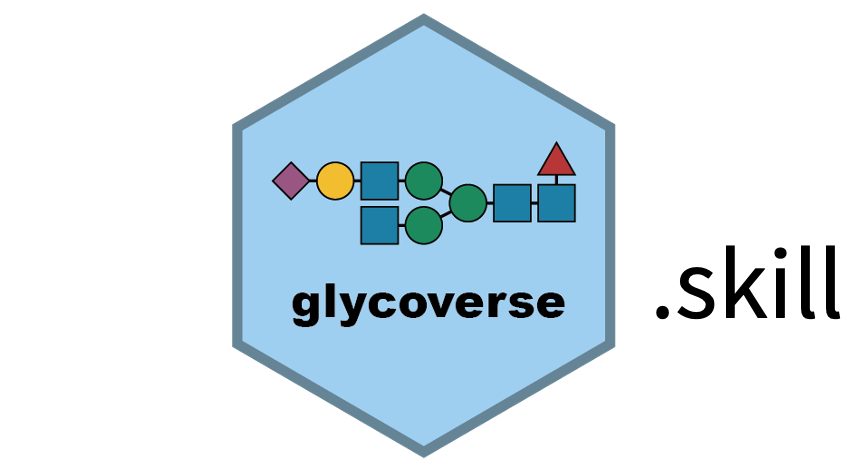

<div align="center">



# Glycoverse Agent Skill

### Give your coding agent a map of the Glycoverse R ecosystem.

[](https://agentskills.io/)
[](https://www.npmjs.com/package/skillfish)
[](https://glycoverse.org.cn/)

<p>
  A compact, source-aware skill that helps AI coding agents choose the right
  Glycoverse packages and discover authoritative, up-to-date help.
</p>

</div>

---

## What your agent learns

This skill gives an agent the context it needs to navigate Glycoverse without
stuffing every package manual into its prompt:

- the broad responsibility of every Glycoverse package;
- how to find installed R help, pkgdown references, vignettes, source code,
  examples, changelogs, and issue trackers;
- how to verify functions and arguments against the live API before proposing
  code;
- where to find the current ecosystem and individual-package installation
  instructions.

<div align="center">

```text
import → organize → clean → analyze → visualize
                   ↕
 represent → parse → annotate → motifs/traits → draw/pathways
```

</div>

## Install

Install directly from this GitHub repository with
[Skillfish](https://www.npmjs.com/package/skillfish):

```sh
npx skillfish add glycoverse/glycoverse.skill
```

If you already use the global Skillfish CLI:

```sh
skillfish add glycoverse/glycoverse.skill
```

Skillfish discovers the root [`SKILL.md`](SKILL.md) automatically and installs
it for the coding agents detected on your machine. This repository does not
install or modify any R packages by itself.

## Use

Invoke the skill explicitly when your agent supports named skills:

```text
Use $glycoverse to build an R workflow that imports pGlyco3 results,
cleans the experiment, runs differential analysis, and plots the result.
```

It also supports focused questions:

```text
Use $glycoverse to find the right package and current documentation for
parsing WURCS and searching for a glycan motif.
```

```text
Use $glycoverse to review this script for invented or outdated API calls.
```

## Package map

| Area | Packages | Purpose |
|---|---|---|
| Entry points | `glycoverse`, `glysmith` | Install/load the ecosystem or run high-level pipelines |
| Omics | `glyexp`, `glyread`, `glyclean`, `glystats`, `glyvis` | Move from experimental data to analysis and communication |
| Structures | `glyrepr`, `glyparse`, `glymotif`, `glydet`, `glydraw` | Represent, parse, inspect, quantify, and draw glycans |
| Specialized | `glydb`, `glyanno`, `glyenzy`, `glyfun` | Database access, annotation, biosynthesis, and enrichment |

The stable package-routing map lives in
[`references/packages.md`](references/packages.md). It deliberately contains no
function-level documentation. The current-help discovery workflow lives in
[`references/help-resources.md`](references/help-resources.md).

## Repository layout

```text
.
├── SKILL.md                     # Agent workflow and routing instructions
├── agents/openai.yaml           # Optional Codex-facing UI metadata
└── references/
    ├── packages.md              # Package catalog and selection guide
    └── help-resources.md        # Authoritative documentation workflow
```

## Design principles

- **Fresh by design:** discover current documentation instead of bundling API
  details that will age.
- **Source-aware:** prefer checked-out source and version-matched installed help.
- **Progressive:** load detailed references only when the task needs them.
- **Composable:** choose the smallest set of packages that solves the task.
- **Portable:** follow the standard `SKILL.md` format used by modern coding
  agents and Skillfish.

## Links

- [Glycoverse website](https://glycoverse.org.cn/)
- [Glycoverse documentation](https://glycoverse.github.io/glycoverse/)
- [Glycoverse on GitHub](https://github.com/glycoverse)
- [Glycoverse R-universe](https://glycoverse.r-universe.dev/)
- [Agent Skills specification](https://agentskills.io/)
- [Skillfish](https://www.npmjs.com/package/skillfish)

---

<div align="center">
  <sub>Built for agents that should check the docs before they write the pipeline.</sub>
</div>
